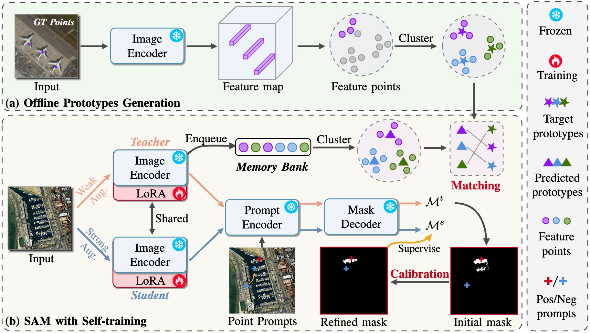

# PointSAM: Pointly-Supervised Segment Anything Model for Remote Sensing Images
<p align="center">
    
</p>

[](https://arxiv.org/abs/2409.13401)
---

## 📢 Latest Updates
- **20 Sep 2024**: The arXiv version is released [here](https://arxiv.org/abs/2409.13401).
---

 The code will be released soon. 

## Overview
<div align="center">
  
</div>

## 🎮 Getting Started
### 1.Install Environment
```bash
conda create --name pointsam python=3.10
conda activate pointsam

pip install torch==2.3.1 torchvision==0.18.1 torchaudio==2.3.1 --index-url https://download.pytorch.org/whl/cu118
git clone https://github.com/Lans1ng/PointSAM.git
cd PointSAM
pip install -r requirements.txt

cd segment_anything_2
pip install -e .
cd ..
```

### 2.Prepare Dataset 

#### WHU Building Dataset

- Dataset download address: [WHU Building Dataset](https://aistudio.baidu.com/datasetdetail/56502)。

- For converting semantic label to instance label, you can refer to corresponding [conversion script](https://github.com/KyanChen/RSPrompter/blob/release/tools/rsprompter/whu2coco.py).

#### HRSID Dataset

- Dataset download address: [HRSID Dataset](https://github.com/chaozhong2010/HRSID).

#### NWPU VHR-10 Dataset

- Dataset download address: [NWPU VHR-10 Dataset](https://aistudio.baidu.com/datasetdetail/52812).

- Instance label download address: [NWPU VHR-10 Instance Label](https://github.com/chaozhong2010/VHR-10_dataset_coco).


```
data 
├── WHU
│    ├── annotations
│    │   ├── WHU_building_train.json
│    │   ├── WHU_building_test.json
│    │   └── WHU_building_val.json
│    └── images
│        ├── train
│        │    ├── image
│        │    └── label
│        ├── val
│        │    ├── image
│        │    └── label
│        └── test
│             ├── image
│             └── label
├── HRSID
│    ├── Annotations
│    │   ├── all
│    │   ├── inshore
│    │   │      ├── inshore_test.json
│    │   │      └── inshore_train.json       
│    │   └── offshore
│    └── JPEGImages
└── NWPU
     ├── Annotations
     │   ├── NWPU_instnaces_train.json
     │   └── NWPU_instnaces_val.json
     └── images

```

## 💡 Acknowledgement

- [wesam](https://github.com/zhang-haojie/wesam)
- [OWOD](https://github.com/JosephKJ/OWOD)
- [RSPrompter](https://github.com/KyanChen/RSPrompter)


## 🖊️ Citation

If you find this project useful in your research, please consider cite:

```BibTeX
@article{liu2024pointsam,
  title={PointSAM: Pointly-Supervised Segment Anything Model for Remote Sensing Images},
  author={Liu, Nanqing and Xu, Xun and Su, Yongyi and Zhang, Haojie and Li, Heng-Chao},
  journal={arXiv preprint arXiv:2409.13401},
  year={2024}
}
```
