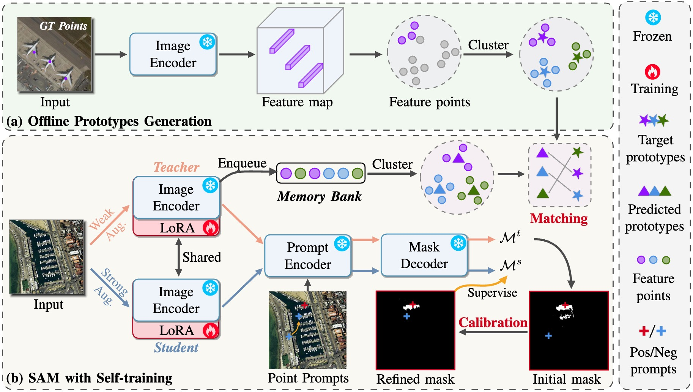

<div align="center">
    
# PointSAM: Pointly-Supervised Segment Anything Model for Remote Sensing Images
<p align="center">
    
</p>

[](https://arxiv.org/abs/2409.13401)

</div>

<!--
---

## ❗️Notice

**Because the issue has been abused recently, I have temporarily closed it. If you have any questions, you can contact me via email at lansing163@163.com.**
-->


---
## 📢 Latest Updates
- **2 Jan 2025**: **PointSAM** has been accepted by TGRS and is now available [here](https://ieeexplore.ieee.org/document/10839471).
- **8 Dec 2024**: The complete code is released.
- **20 Sep 2024**: The arXiv version is released [here](https://arxiv.org/abs/2409.13401).
---


## 🎨 Overview



## 🎮 Getting Started
### 1.Install Environment
To ensure compatibility, **Python version must not exceed 3.10**. Follow these steps to set up your environment:
```bash
conda create --name pointsam python=3.10
conda activate pointsam

pip install torch==2.3.1 torchvision==0.18.1 torchaudio==2.3.1 --index-url https://download.pytorch.org/whl/cu118
git clone https://github.com/Lans1ng/PointSAM.git
cd PointSAM
pip install -r requirements.txt
```

**Note:**
The CUDA version in the `pip install` command is specified as `cu118` (CUDA 11.8). If your system uses a different CUDA version (e.g., CUDA 12.1), replace `cu118` with the appropriate version tag (e.g., `cu121`). 

### 2.Prepare Dataset 

#### WHU Building Dataset

- Dataset download address: [WHU Building Dataset](https://aistudio.baidu.com/datasetdetail/56502)。

- For converting semantic label to instance label, you can refer to corresponding [conversion script](https://github.com/KyanChen/RSPrompter/blob/release/tools/rsprompter/whu2coco.py).

#### HRSID Dataset

- Dataset download address: [HRSID Dataset](https://github.com/chaozhong2010/HRSID).

#### NWPU VHR-10 Dataset

- Dataset download address: [NWPU VHR-10 Dataset](https://aistudio.baidu.com/datasetdetail/52812).

- Instance label download address: [NWPU VHR-10 Instance Label](https://github.com/chaozhong2010/VHR-10_dataset_coco).

For convenience, the necessary JSON annotations are included in this repo. You only need to download the corresponding images. Organize your dataset as follows:

```
data 
├── WHU
│    ├── annotations
│    │   ├── WHU_building_train.json
│    │   ├── WHU_building_test.json
│    │   └── WHU_building_val.json
│    └── images
│        ├── train
│        │    ├── image
│        │    └── label
│        ├── val
│        │    ├── image
│        │    └── label
│        └── test
│             ├── image
│             └── label
├── HRSID
│    ├── Annotations
│    │   ├── all
│    │   ├── inshore
│    │   │      ├── inshore_test.json
│    │   │      └── inshore_train.json       
│    │   └── offshore
│    └── Images
└── NWPU
     ├── Annotations
     │   ├── NWPU_instnaces_train.json
     │   └── NWPU_instnaces_val.json
     └── Images

```
### 3.Download Checkpoints

Click the links below to download the checkpoint for the corresponding model type.

- `vit-h`: [ViT-H SAM model.](https://dl.fbaipublicfiles.com/segment_anything/sam_vit_h_4b8939.pth)
- `vit-l`: [ViT-L SAM model.](https://dl.fbaipublicfiles.com/segment_anything/sam_vit_l_0b3195.pth)
- `vit-b`: [ViT-B SAM model.](https://dl.fbaipublicfiles.com/segment_anything/sam_vit_b_01ec64.pth)

After downloading, move the models to the `pretrain` folder.

**Note**: In our project, only the `vit-b` model is used.

### 4.Training
For convenience, the `scripts` folder provides training instructions for **three different methods** implemented on the **NWPU VHR-10**, **WHU**, and **HRSID** datasets:

- **Supervised Training** – mask supervised and uses full mask annotations.  
- **Self-Training** – a point supervised baseline that uses pseudo labels generated by SAM.  
- **PointSAM** – the proposed PointSAM method trained with point-level annotations.

Here’s an example of training **PointSAM** on the **WHU** dataset:
```
bash scripts/train_whu_pointsam.sh
```
### 5. Inference

Here’s an example of how to perform inference:

```
python inference.py --cfg <CONFIG_FILE_PATH> --out_dir <OUTPUT_DIR> --ckpt <CHECKPOINT_PATH>
```

Please replace `<CONFIG_FILE_PATH>`, `<OUTPUT_DIR>`, and `<CHECKPOINT_PATH>` with the values of the actual path.

**Note:** The generated results consist of four images arranged in parallel:  

- The first image is the original input image.  
- The second image is the visualization of the GT mask.  
- The third image is the result obtained by direct testing through the original SAM.  
- The fourth image is the result obtained using the provided checkpoint.


## 💡 Acknowledgement

- [wesam](https://github.com/zhang-haojie/wesam)
- [OWOD](https://github.com/JosephKJ/OWOD)
- [RSPrompter](https://github.com/KyanChen/RSPrompter)


## 🖊️ Citation

If you find this project useful in your research, please consider starring ⭐ and citing 📚:

```BibTeX
@ARTICLE{10839471,
  author={Liu, Nanqing and Xu, Xun and Su, Yongyi and Zhang, Haojie and Li, Heng-Chao},
  journal={IEEE Transactions on Geoscience and Remote Sensing}, 
  title={PointSAM: Pointly-Supervised Segment Anything Model for Remote Sensing Images}, 
  year={2025},
  volume={63},
  number={},
  pages={1-15},
  doi={10.1109/TGRS.2025.3529031}}

```
